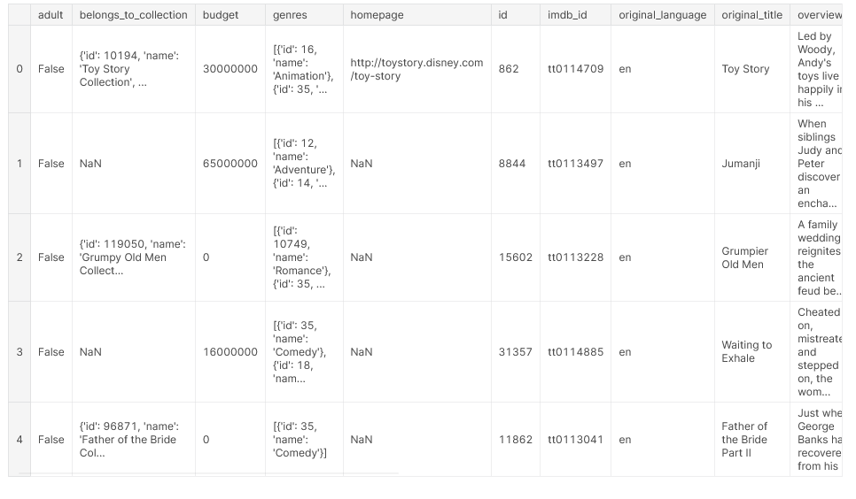
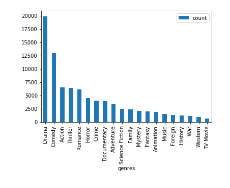
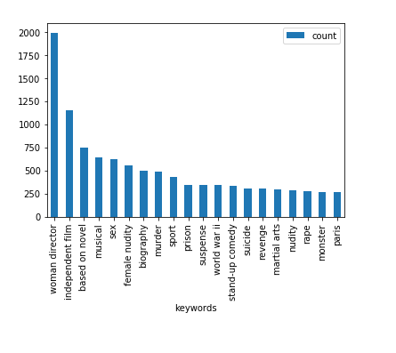
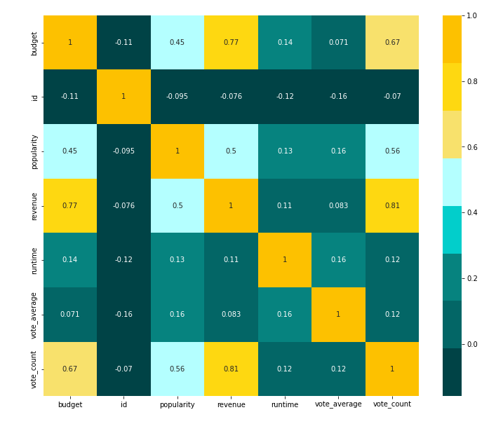
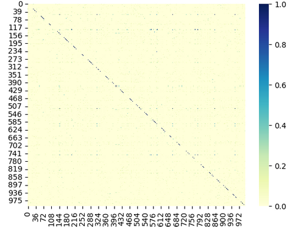
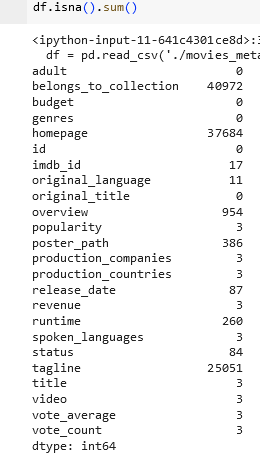
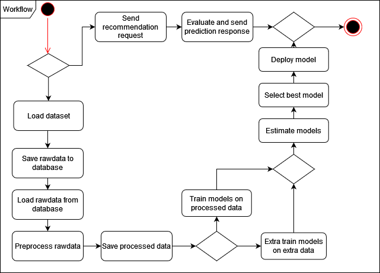
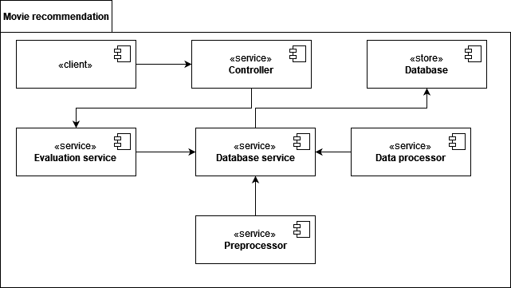
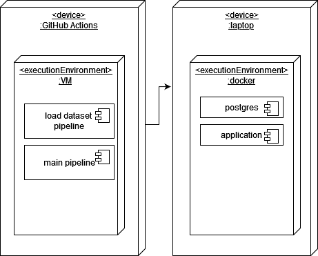

# Проект "Рекомендация фильмов"
-----
### Автор - Владимирский Сергей (P4115)

#### Цель
Создание рекомендательной системы для рекомендации фильмов для конкретного пользователя

#### Задачи
1. Сбор данных;
2. Проектирование архитектуры системы;
3. Обучение моделей на основе обучающей выборки;
4. Оценка моделей на тестовой выборке;
5. Выбор лучшей модели;
6. Разворачивание лучшей модели.

Датасет: [The Movies Dataset](https://www.kaggle.com/datasets/rounakbanik/the-movies-dataset)
Проект: [movie-recommendation](https://github.com/hotstreams/movie-recommendation)

#### Характеристика:

Датасет содержит метаданные для 45000 фильмов, которые располагаются в нескольких файлах.
movies_metadata.csv - содержит информацию о самих фильмах: названия, оригинальные названия, идентификаторы, бюджет, синопсис, бюджет и т.д.
keywords.csv - содержит информацию о ключевых словах фильмов
links.csv - содержит информацию о соответствии различных идентификаторов фильмов
ratings.csv - содержит информацию о оценках конкретных пользователей фильмам

#### Целесообразность использования датасета для решения поставленной задачи
Датасет имеет достаточный объем данных для обучения модели, содержит текстовое описание по tagline, keywords, genres и overview, которое можно использовать для content-based модели, а также достаточное количество рейтингов пользователей.
Распределения по жанрам и ключевым словам изображены ниже. 

Пример датасета

#### Диаграмма активности

#### Диаграмма компонентов

#### Диаграмма развертывания

